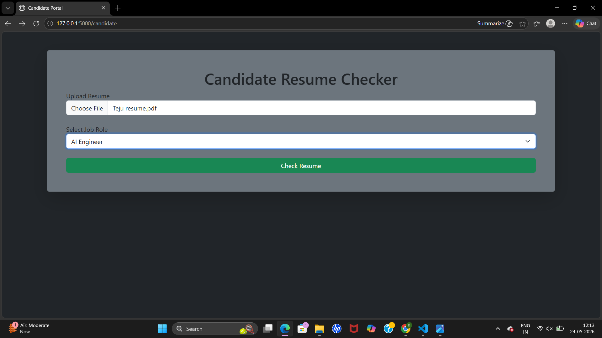
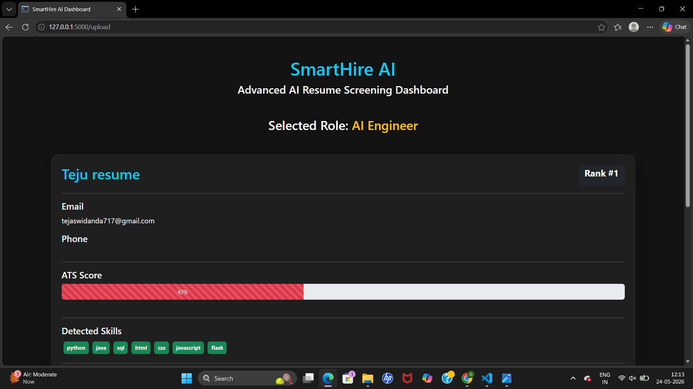

# SmartHire AI

AI-powered Resume Screening and ATS Analysis System using Python and Flask.

## Features

- AI Resume Screening
- ATS Score Detection
- Resume Ranking Dashboard
- Skill Extraction
- Education Detection
- Fake Resume Detection
- AI Suggestions
- Job Role Matching

## Technologies Used

- Python
- Flask
- HTML
- CSS
- Bootstrap
- PDFPlumber

## Installation

```bash
pip install -r requirements.txt
python app.py
## Screenshots

### Dashboard



### ATS Analysis


## Screenshots

### Dashboard


### ATS Score




### AI Suggestions


### Resume Ranking

